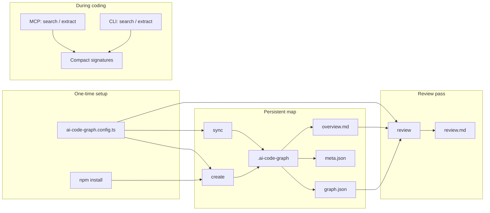

# ai-code-graph

> **Save tokens. Understand the codebase faster. Build knowledge that lasts.**

TypeScript-first toolkit: a **persistent graph** (files, symbols, imports), **incremental sync**, **compact MCP/CLI search** (signatures only—low tokens), optional **LLM review**, and artifacts your team and agents can share (`overview.md`, `graph.json`).

**In three lines**

| Goal | How ai-code-graph helps |
|------|-------------------------|
| **Save tokens** | **`search`** / **`extract`** and MCP tools return **short signature lines** instead of whole files; **`@` overview** gives structure without pasting the repo. |
| **Understand the codebase faster** | **`overview.md`** + **`graph.json`** = table of contents, imports, and where symbols live—orient before you deep-read. |
| **Build knowledge (and keep it)** | **`create` → `sync`** refreshes only what changed; commit or regenerate artifacts so onboarding, review, and AI sessions share the **same map**. |

---

## Benefits

**For AI coding assistants (Cursor, Claude, …)**  
- **Less context, same orientation:** MCP **`search`** / **`extract`** return **signatures only** (`path:line` + declaration head), so models locate APIs without pasting whole files into the prompt.  
- **Structure, not just text:** **`graph.json`** and **`overview.md`** encode **imports**, **symbol ownership**, and **how pieces connect**—better than a flat file tree for “what calls what” and “where does this live?”  
- **Stable artifacts to `@`:** Pin **`overview.md`** or **`graph.json`** in chat so every turn shares the same map; refresh with **`sync`** when the branch moves.

**For you as a developer**  
- **Faster ramp:** One **`overview.md`** pass gives a **table-of-contents** of exported surface area before you open editors.  
- **Precise jumps:** Search hits include **file + line** so you jump straight to declarations.  
- **Stays fresh cheaply:** **`sync`** reparses **only changed files** (via **`meta.json`** hashes), so keeping the map current is a small habit, not a full rebuild every time.

**For teams and maintainers**  
- **Shared mental model:** Commit **`overview.md`** (and optionally **`graph.json`**) so reviews, onboarding, and agents align on the same structure.  
- **Repeatable review:** **`review`** turns the graph + digest into **`review.md`** through any **OpenAI-compatible** API—useful before merges or release checks.  
- **One config everywhere:** **`ai-code-graph.config.ts`** defines **include / exclude / output / LLM** once; CLI and MCP behave consistently.

**Operational**  
- **Local parsing:** Scans use the **TypeScript compiler API** on disk—no need to upload your repo to a third party for **`create` / `sync` / `search`**.  
- **LLM only where you want it:** **`review`** is optional; point **`baseURL`** at your gateway or host.  
- **Works in-editor:** MCP **`stdio`** integrates with Cursor and other MCP clients without a separate dashboard.

---

## How it fits together (workflow)

Use one tool for three layers of context: **live discovery** (small payloads), **structured map** (relationships), and **review** (LLM output).



### Flow in practice

1. **Bootstrap the repo**  
   Install the package, copy `ai-code-graph.config.example.ts` to `ai-code-graph.config.ts`, set `include` / `exclude` and (for `review`) `llm` / `OPENAI_API_KEY`.

2. **Build the knowledge map**  
   Run **`create`** once. You get:
   - **`graph.json`** — full structure: files, symbols, **import/export edges**, `contains`, `extends` / `implements` hints.
   - **`meta.json`** — SHA-256 per file for incremental updates.
   - **`overview.md`** — a short, human/LLM-friendly digest (files, symbols, import map).

3. **Day-to-day coding (low tokens)**  
   - Wire **MCP** in Cursor (see below) so the agent can call **`search`** / **`extract`** and get **signature-only** hits (`path:line` + signature).  
   - Optionally run **`sync`** after meaningful edits so `graph.json` / `overview.md` stay current without a full rescan. Only changed files are reparsed (via `meta.json` hashes).

4. **Deeper context when needed**  
   In Cursor, **`@`-mention** `overview.md` or `graph.json` (or a non-hidden `outputDir` if you prefer) so the model sees **relationships**, not just a flat list of signatures.

5. **Review pass**  
   Run **`review`** to send **overview + graph** (with configurable size cap) to any **OpenAI-compatible** endpoint and write **`review.md`** for PR prep or audits.

6. **Team / CI (optional)**  
   Commit `.ai-code-graph/overview.md` (and optionally `graph.json`) so everyone and every agent shares the same map; keep secrets out of the repo. Alternatively generate in CI and attach as artifacts.

---

## What you get

| Layer | What it does |
|-------|----------------|
| **Compact search** | **`search`** / **`extract`** (CLI or MCP) return **exported** TypeScript symbols as **signatures only**—small enough for tool results and quick orientation. |
| **Graph** | **`graph.json`** stores **files**, **symbols**, and **edges** (`imports`, `exports_to`, `contains`, `extends` / `implements` where extracted). |
| **Incremental map** | **`sync`** uses **`meta.json`** hashes so only changed files are reparsed. |
| **Readable digest** | **`overview.md`** summarizes files, symbols, and imports for people and models. |
| **Review** | **`review`** sends overview + graph to an **OpenAI-compatible** API and writes **`review.md`**. |
| **Config** | **`ai-code-graph.config.ts`** drives **`include` / `exclude` / `outputDir` / `llm`** for all commands. |
| **Languages** | **TypeScript family** (`.ts`, `.tsx`, `.mts`, `.cts`) via the TypeScript compiler API. |

---

## Commands

| Command | Description |
|--------|-------------|
| `npx ai-code-graph create` | Full scan → `graph.json`, `meta.json`, `overview.md` |
| `npx ai-code-graph sync` | Update only changed files (from `meta.json` hashes) |
| `npx ai-code-graph review` | Send graph + overview to LLM → `review.md` |
| `npx ai-code-graph search -f <pattern> [paths...]` | Compact **exported** signatures matching substring (path:line + signature) |
| `npx ai-code-graph extract [paths...]` | All compact **exported** signatures under paths |
| `npx ai-code-graph mcp` | **MCP** over stdio |

**Flags:** `search` / `extract` support **`--all`** to include non-exported symbols (more noise, more coverage).

---

## MCP (Cursor and others)

Project example (`.cursor/mcp.json`):

```json
{
  "mcpServers": {
    "ai-code-graph": {
      "command": "npx",
      "args": ["ai-code-graph", "mcp"],
      "cwd": "${workspaceFolder}"
    }
  }
}
```

Local install alternative: `"command": "node"`, `"args": ["node_modules/ai-code-graph/dist/cli.js", "mcp"]`.

**Tools**

| Tool | Role |
|------|------|
| `search` | `pattern` + optional `paths`; optional `includeNonExported` |
| `extract` | Optional `paths`; optional `includeNonExported` |
| `list_languages` | Documents TS extensions supported by the compact scanner |

**Cursor rule (recommended):** Add a project rule such as: *For TypeScript declaration discovery, prefer the ai-code-graph MCP `search` / `extract` tools before repo-wide grep; use grep for string literals, configs, and non-TS files.* MCP does not run automatically without guidance.

---

## Outputs (default: `.ai-code-graph/`)

| File | Purpose |
|------|---------|
| `graph.json` | Structured **nodes** (files, symbols) and **edges** (imports, contains, …) |
| `meta.json` | Per-file **content hashes** for `sync` |
| `overview.md` | **Readable** summary: files, symbols, import map — ideal for `@` context |
| `review.md` | Output of `review` |

**Hidden vs visible folder:** Dot-folders work fine with Cursor and LLMs. To use a normal directory (e.g. easier to spot in the tree), set in config:

```ts
outputDir: "ai-code-graph"
```

---

## Config

Add **`ai-code-graph.config.ts`** (see `ai-code-graph.config.example.ts`). All commands respect **`include`**, **`exclude`**, **`outputDir`**, and **`llm`** (for `review`).

---

## Install

```bash
npm install --save-dev ai-code-graph
```

---

## Graph shape

```json
{
  "version": 1,
  "generatedAt": "...",
  "root": "/absolute/path/to/project",
  "nodes": [],
  "edges": []
}
```

Nodes include **file** entries and **symbol** entries (function, class, interface, type, enum, namespace, …). Edges model **imports**, **re-exports**, **contains**, and type **extends** / **implements** (where extracted).

---

## Environment

| Variable | Purpose |
|----------|---------|
| `OPENAI_API_KEY` | Default API key when `llm.apiKey` is not set in config |
| `AI_CODE_GRAPH_MAX_CONTEXT` | Max characters of `graph.json` embedded in the `review` prompt (default `120000`) |

---

## Scope and roadmap

- **Today:** TypeScript family only for graph + compact scan; **OpenAI-compatible** HTTP for `review`.
- **Natural extensions:** more languages for the graph, optional streaming review, richer edge kinds, CI recipes.
